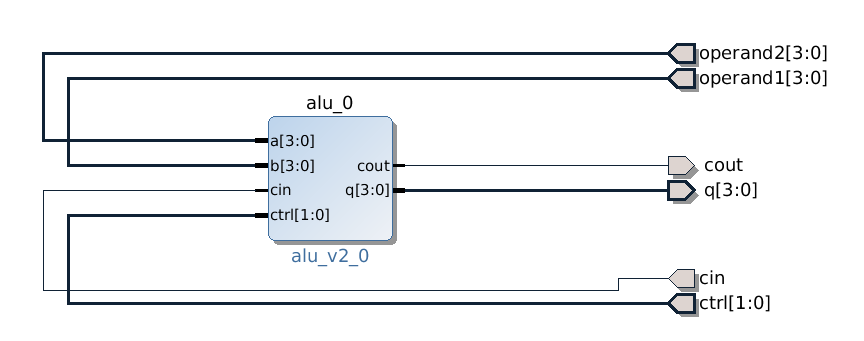

.. tags: ALU, VHDL, testbench

Arithmetic logic unit
=====================

Arithmetic logic unit refers to carry ripple adder designed earlier [#cra]_.

.. listing:: src/alu.vhd

A simple testbench:

.. listing:: src/alu_testbench.vhd

Loading to ZYBO
---------------

    High level block design in Vivado

BTN4 and BTN5 seem to be unusable from FPGA portion since they're
part of multiplexed I/O, so I had to resort to pins at Pmod connector JE.

Pin mapping at **Constraints** → **constrs_1** → **base.xdc**:

.. code::

    # Operand1 at switch block
    set_property PACKAGE_PIN R18 [get_ports {operand1[0]}]
    set_property PACKAGE_PIN P16 [get_ports {operand1[1]}]
    set_property PACKAGE_PIN V16 [get_ports {operand1[2]}]
    set_property PACKAGE_PIN Y16 [get_ports {operand1[3]}]
    set_property IOSTANDARD LVCMOS33 [get_ports {operand1[*]}]

    # Operand2 at button block
    set_property PACKAGE_PIN G15 [get_ports {operand2[0]}]
    set_property PACKAGE_PIN P15 [get_ports {operand2[1]}]
    set_property PACKAGE_PIN W13 [get_ports {operand2[2]}]
    set_property PACKAGE_PIN T16 [get_ports {operand2[3]}]
    set_property IOSTANDARD LVCMOS33 [get_ports {operand2[*]}]

    # Output at LED block
    set_property PACKAGE_PIN M14 [get_ports {q[0]}]
    set_property PACKAGE_PIN M15 [get_ports {q[1]}]
    set_property PACKAGE_PIN G14 [get_ports {q[2]}]
    set_property PACKAGE_PIN D18 [get_ports {q[3]}]
    set_property IOSTANDARD LVCMOS33 [get_ports {q[*]}]

    # Instruction at JE1 and JE2
    set_property PACKAGE_PIN V12 [get_ports {ctrl[0]}]
    set_property PACKAGE_PIN W16 [get_ports {ctrl[1]}]
    set_property IOSTANDARD LVCMOS33 [get_ports {ctrl[*]}]

    # Carry out at JE3
    set_property PACKAGE_PIN J15 [get_ports {cout}]
    set_property IOSTANDARD LVCMOS33 [get_ports {cout}]

    # Carry in at JB
    set_property PACKAGE_PIN U20 [get_ports {cin}]
    set_property IOSTANDARD LVCMOS33 [get_ports {cin}]

.. [#cra] `Carry ripple adder <carry-ripple-adder.html>`_
