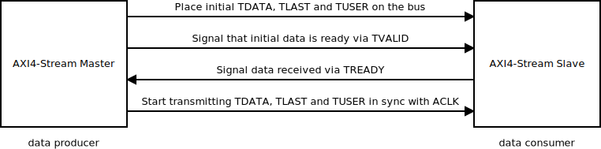
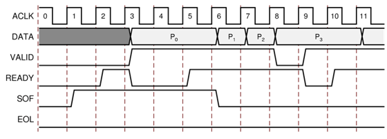

.. flags: hidden

Arbitrary data streams
======================

Introduction
------------

AXI4-Stream is part of AMBA interface specification.
AXI4-Stream Video is a subset of AXI4-Stream designed for transporting
video frames.

AXI4-Stream
-----------

It's a protocol designed to transport arbitrary unidirectional data streams.

    AXI4-Stream handshake
    
In AXI4-Stream TDATA width of bits is transferred per clock cycle.
The transfer is started once sender signals TVALID and received responds with TREADY.
TLAST signals the last byte of the stream.

    Example of READY/VALID Handshake, Start of a New Frame

AXI4-Stream has additional optional features: sending positional
data with TKEEP and TSTRB ports which make it possible to multiplex 
both data position and data itself on TDATA lines;
routing streams by TID and TDIST which roughly corresponds to stream identifier
and stream destination identifier [#fpganotes]_

.. [#fpganotes] http://wiki.fpganotes.com/doku.php/ip:bus:axi4_stream

AXI4-Stream Video
-----------------

AXI4-Stream Video is compatible with AXI4-Stream components, it simply
has conventions for the use of ports already defined by AXI4-Stream:

* The TLAST signal designates the last pixel of each line, and is also known as
  end of line (EOL).
* The TUSER signal designates the first pixel of a frame and is known as
  start of frame (SOF).

These two flags are necessary to identify pixel locations on the AXI4
stream interface because there are no sync or blank signals. [#axi-stream-to-video-out]_.
Video DMA component makes use of the TUSER signal to synchronize frame buffering.

.. [#axi-stream-to-video-out] http://www.xilinx.com/support/documentation/ip_documentation/v_axi4s_vid_out/v1_0/pg044_v_axis_vid_out.pdf
