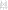

.. tags: flip-flop, latch, VHDL, D latch, SR latch

Flip-flops
==========

Introduction
------------

In this article I'll attempt to outline major storage elements.
In modern terminology:

* Latch is simple, transparent, not clocked, asynchronous, level-sensitive
* Flip-flop is edge-triggered, opaque, clocked, synchronous, edge-sensitive

SR latch as memory element
--------------------------

For instance SR latch can essentially be used to store one bit of information [#kth]_:

    SR latch can be constructed with two NOR gates

Corresponding concurrent VHDL snippet would be:

.. listing:: src/sr_latch.vhd

Replacing NAND operation with NOR should yield in equivalent circuit with
inputs and outputs inverted however such circuit gets stuck in an unstable
state. Attempting to simulate such circuit using GHDL results in following error message:

.. code::

    ./srlatch_testbench:error: simulation stopped by --stop-delta

This means that GHDL has stopped simulation because states could not settle
within --stop-delta=N delta cycles without progressing time.

Gated SR latch
--------------

Gated SR latch, also known as *clocked SR latch* or *synchronous SR latch* or
*SR flip-flop* can be used as register [#kth]_:

    Clocked SR latch constructed with four NAND gates

Again corresponding VHDL snippet:

.. listing:: src/d_register.vhd

For instance single SR latch could be implemented using single SN7400N [#sn7400n]_ integrated circuit:

.. figure:: http://quarndon.co.uk/images2/components/7400_dil_pin.gif

    SN7400N integrated circuit contains four NAND gates

D latch
-------

D latch also known as data latch can be used to trap the value on the
output what was set while write enable is high.
D latch is usually composed of an SR latch in conjunction with gating functionality.
Mux with output connected to one of the inputs and clock connected to select pin
could also be used to model D latch.
In several examples *write enable* is substituted with *clock* signal so
in certain contexts it makes sense to say that D latch is clocked element [#data_latch]_:

    D latch can be implemented with four NAND gates

Corresponding VHDL snippet:

.. listing:: src/d_latch.vhd

Reset pin can be added in which case two variations are distinguished,
first of them is D latch with asynchronous reset:

.. code:: vhdl

    process(d, clk, reset)
    begin
        if (reset = '0') then
            q <= '0';
        elsif (clk = '1') then
            q <= d;
        end if;
    end process;

And another one is with synchronous reset:

.. code:: vhdl

    process(d, clk, reset)
    begin
        if (clk = '1') then
            if (reset = '0') then
                q <= '0';
            else
                q <= d;
            end if;
        end if;
    end process;

.. [#kth] http://www.it.kth.se/courses/IL2217/F4_2.pdf
.. [#sn7400n] http://quarndon.co.uk/index.php?main_page=product_info&products_id=12966
.. [#data_latch] http://www.play-hookey.com/digital/sequential/d_nand_latch.html

