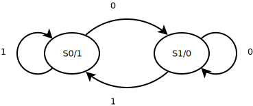
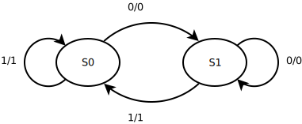
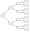

.. tags: VHDL, KTH

Finite state machines
=====================

Moore machine
-------------

Moore machine is a finite state machine whose output depends only on
current state.
Finite in this case refers to number of states.

    Moore machine
    
Moore machine can be defined as 6-tuple:

.. math::

    M = (S, S_0, \Sigma, \Lambda, T, G)
    
Where:

* S is finite set of states;
* S₀ is the initial state;
* Σ is the input alphabet;
* Λ is the output alphabet
* T is the transition function which maps state and input to next state
* G is the mapping function which maps each state to the output alphabet

Moore machine can also be expressed as diagram as shown in the figure below.
    

    Moore machine state diagram notation
    

    Moore machine example with two states and four transitions

Moore machine can also be expressed as state transition table also
known as *flow table*:

+-----+-------------+----------+------+
|Input|Current state|Next state|Output|
+-----+-------------+----------+------+
|0    |S0           |S1        |1     |
+-----+-------------+----------+------+
|0    |S1           |S1        |0     |
+-----+-------------+----------+------+
|1    |S1           |S1        |0     |
+-----+-------------+----------+------+
|1    |S0           |S0        |1     |
+-----+-------------+----------+------+

Mealy machine
-------------

Mealy machine is a finite state machine where outputs is determined by
both - current state and current inputs.

    Mealy machine
    

    Mealy machine state diagram notation
    

    Mealy machine example with two states and four transitions
    
Mealy machine with latched outputs is essentially Moore machine.

State minimization
------------------

Consider following non-minimized state diagram derived from the
behavioural specification.

    Mealy machine with single input I, single output and 7 states.
    
In order to minimize a FSM flow table can be used.

+-----------+-------------+-------------+
| State tag | Next state  | Output      |
|           +------+------+------+------+
|           | I=0  | I=1  | I=0  | I=1  |
+-----------+------+------+------+------+
| S0        | S1   | S2   | 0    | 1    |
+-----------+------+------+------+------+
| S1        | S3   | S4   | 1    | 1    |
+-----------+------+------+------+------+
| S2        | S5   | S6   | 0    | 0    |
+-----------+------+------+------+------+
| S3        | S1   | S2   | 0    | 1    |
+-----------+------+------+------+------+
| S4        | S1   | S6   | 0    | 0    |
+-----------+------+------+------+------+
| S5        | S3   | S2   | 1    | 1    |
+-----------+------+------+------+------+
| S6        | S1   | S2   | 0    | 1    |
+-----------+------+------+------+------+

All output combinations belong to the same class:

.. math::

    \{S_0, S_3, S_6\}, \{S_1, S_5\}, \{S_2, S_4\}
    
States that have the same future and same outputs are equivalent:

.. math::

    E_0 = {S_0, S_3, S_6} \\
    E_1 = {S_1} \\
    E_2 = {S_2} \\
    E_4 = {S_4} \\
    E_5 = {S_5}
    
Minimized flow table basically substitutes states 3 and 6 with state 0:
    
+-----------+-------------+-------------+
| State tag | Next state  | Output      |
|           +------+------+------+------+
|           | I=0  | I=1  | I=0  | I=1  |
+-----------+------+------+------+------+
| E0        | E1   | E2   | 0    | 1    |
+-----------+------+------+------+------+
| E1        | E0   | E4   | 1    | 1    |
+-----------+------+------+------+------+
| E2        | E5   | E0   | 0    | 0    |
+-----------+------+------+------+------+
| E4        | E1   | E0   | 0    | 0    |
+-----------+------+------+------+------+
| E5        | E0   | E2   | 1    | 1    |
+-----------+------+------+------+------+

    Minimized finite state machine with 5 states.

State encoding
--------------

There are three main methods for encoding state of a state machine.
When using binary of Gray code a decoder is required to determine the state.
With one-hot encoding a decoder is not necessary.

+------+---------+--------+
|Binary|Gray code|One-hot |
+------+---------+--------+
|000   |000      |00000001|
+------+---------+--------+
|001   |001      |00000010|
+------+---------+--------+
|010   |011      |00000100|
+------+---------+--------+
|011   |010      |00001000|
+------+---------+--------+
|100   |110      |00010000|
+------+---------+--------+
|101   |111      |00100000|
+------+---------+--------+
|110   |101      |01000000|
+------+---------+--------+
|111   |100      |10000000|
+------+---------+--------+

Hamming distance for binary encoding varies. For Gray code hamming distance
is 1 for linear state progression, which is preferred in some cases
to save power as number of transistor switches is decreased.
For hot-one encoding the hamming distance is always 2 regardless of transition.
