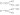
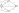

.. tags: VHDL, KTH, Manchester

Manchester coding
=================

Introduction
------------

Manchester coding also known as phase coding is used in IEEE 802.3 (Ethernet) standards.
In IEEE 802.2 data bit 1 is encoded as rising edge and
data bit 0 is encoded as falling edge.

Sequential 11 and 00 is considered illegal state and
next input should be ignored to synchronize. Therefore total of
three inputs should be discarded.

    Manchester decoder specification, input sequence corresponding to output sequence.
    
Note that this is NFA (nondeterministic finite automaton) due to the fact
that there is no way to know where to go with only one lookahead symbol.

    Reduced state diagram

Mealy version
-------------

The outputs are scheduled as early as possible while avoiding conflicts.

    Manchester decoder as Mealy machine

Next step is to label states.

    Manchester decoder as Mealy machine
    
Corresponding flow table:

+-----------+-------------+-------------+
| State tag | Next state  | Output      |
|           +------+------+------+------+
|           | i=0  | i=1  | i=0  | i=1  |
+-----------+------+------+------+------+
| S0        | S1   | S3   | 0    | 1    |
+-----------+------+------+------+------+
| S1        | S2   | S0   | –    | 0    |
+-----------+------+------+------+------+
| S2        | S0   | S0   | –    | –    |
+-----------+------+------+------+------+
| S3        | S4   | S0   | 1    | –    |
+-----------+------+------+------+------+
| S4        | S0   | S0   | –    | –    |
+-----------+------+------+------+------+

Next step is to substitute don't care outputs for example with zeros.
All output combinations that are the same belong to the same class.
Classes that have the same future are equivalent.
Thus S2 and S4 can be merged.

+-----------+-------------+-------------+
| State tag | Next state  | Output      |
|           +------+------+------+------+
|           | i=0  | i=1  | i=0  | i=1  |
+-----------+------+------+------+------+
| E0        | E1   | E3   | 0    | 1    |
+-----------+------+------+------+------+
| E1        | E0   | E2   | 1    | 0    |
+-----------+------+------+------+------+
| E2        | E0   | E0   | 0    | 0    |
+-----------+------+------+------+------+
| E3        | E2   | E0   | 1    | 0    |
+-----------+------+------+------+------+

    Minimized state diagram
    

State encoding
--------------

There are many possible ways to encode states in logic:

+-----------------+-----------------+-----------------+-----------------+
| State tag       | Binary encoding | Gray encoding   | One-hot         |
+-----------------+-----------------+-----------------+-----------------+
| E0              | 00              | 00              | 0001            |
+-----------------+-----------------+-----------------+-----------------+
| E1              | 01              | 01              | 0010            |
+-----------------+-----------------+-----------------+-----------------+
| E2              | 10              | 11              | 0100            |
+-----------------+-----------------+-----------------+-----------------+
| E3              | 11              | 10              | 1000            |
+-----------------+-----------------+-----------------+-----------------+

Binary encoding yields total hamming distance of 10:

.. figure:: dia/manchester-decoder-as-mealy-binary-hamming-distance.svg

    Hamming distances of transitions using binary encoding.
    
Binary encoding yields total hamming distance of 8:

.. figure:: dia/manchester-decoder-as-mealy-gray-hamming-distance.svg

    Hamming distances of transitions using Gray encoding.
    
Hamming distances using one-hot encoding yields total distance of 14:

.. figure:: dia/manchester-decoder-as-mealy-one-hot-hamming-distance.svg

    Hamming distances of transitions using one-hot encoding.

Using gray encoding for the states yields in following flow table:

+-----------+-------------------+-------------------+
| State     | Next state (tn,un)| Output (q)        |
| (t,u)     +---------+---------+---------+---------+
|           | i=0     | i=1     | i=0     | i=1     |
+-----------+---------+---------+---------+---------+
| 00        | 01      | 10      | 0       | 1       |
+-----------+---------+---------+---------+---------+
| 01        | 00      | 11      | 1       | 0       |
+-----------+---------+---------+---------+---------+
| 11        | 00      | 00      | 0       | 0       |
+-----------+---------+---------+---------+---------+
| 10        | 00      | 00      | 1       | 0       |
+-----------+---------+---------+---------+---------+

Karnaugh map here is omitted, instead it's pretty obvious the
next state can be expressed as:

.. math:: t_{next} = \neg t \land i
.. math:: u_{next} = \neg u \land \left( \neg t  \land \neg i \lor i \land u \right)

And the output corresponding to current input and state:

.. math:: q = \neg i \land t \oplus u \lor i \land \neg \land t \neg u

Corresponding VHDL code:

.. code:: vhdl

    library ieee;
    use ieee.std_logic_1164.all;
    
    entity manchester is
        port (
            clk    : in std_logic;
            resetn : in std_logic;
            i      : in std_logic;
            q      : out std_logic
        );
    end manchester;
    
    architecture behaviour of manchester is
        signal t, u, t_next, u_next := '0';
    begin
        -- Mealy output depends on present state (u, t) and input (i)
        u1: process(t, u, i)
        begin
            q      <= not i and t xor u or i and not t and not u
            t_next <= not t and i;
            u_next <= not u and (not t and not i or i and u);
        end process;
        
        -- State transition occurs during rising edge of the clock
        u2: process(clk, resetn)
        begin
            if resetn = '0' then
                u <= '0';
                t <= '0';
            elsif clk'event and clk = '1' then
                u <= u_next;
                t <= t_next;
            end IF;
        end process;
    end behaviour;

