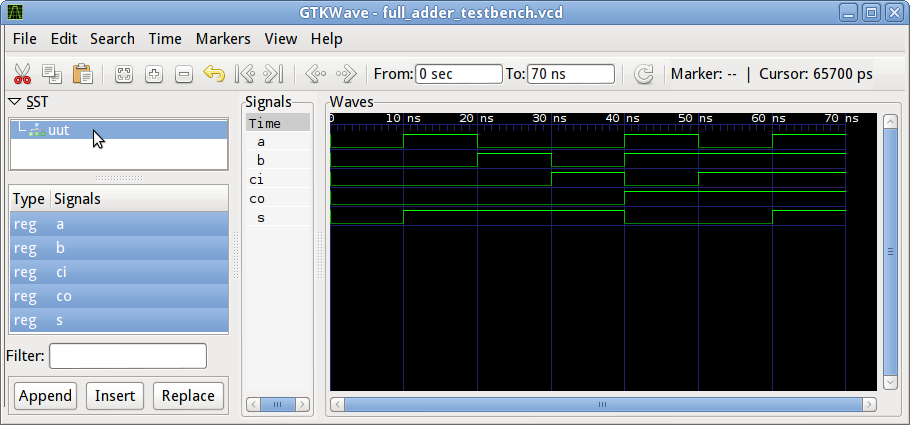

.. tags: VHDL, GTKWave, KTH

Using GTKWave to analyze waveforms
==================================

Consider following VHDL snippet:

.. listing:: src/full_adder_testbench.vhd

Executing roughly following will generate **full_adder_testbench.vcd** which
will contain the waveform data:

.. code:: bash

    ghdl -a full_adder.vhd
    ghdl -a full_adder_testbench.vhd
    ghdl -e full_adder_testbench
    ./full_adder_testbench --vcd=full_adder_testbench.vcd
	
Launch GTKWave with the filename as argument:

.. code:: bash

    gtkwave full_adder_testbench.vcd
    
On the left hand select signals while holding Shift/Ctrl and hit Append on the bottom.
Use Shift-Ctrl-R to reload the VCD file without reconfiguring GTKWave signal selection:

    Full adder testbench waveforms in GTKWave
