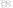
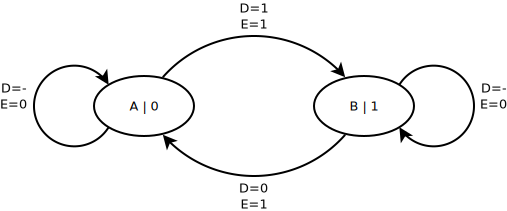

.. tags: flip-flop, latch, VHDL, D latch, SR latch, KTH

D-latch
=======

Introduction
------------

D latch also known as data latch can be used to trap the value on the
output what was set while write enable is high.

D latch internals
-----------------

D latch is usually composed of an SR latch in conjunction with gating functionality.
Mux with output connected to one of the inputs and clock connected to select pin
could also be used to model D latch.
In several examples *write enable* is substituted with *clock* signal so
in certain contexts it makes sense to say that D latch is clocked element [#data_latch]_:

    D latch can be implemented with four NAND gates
    
Boolean formula corresponding to D latch:

.. math:: Q = E \cdot D + \overline{E} \cdot Q_{previous}

A 2:1 multiplexer can also be used to implement a latch.

    D latch can be implemented with 2:1 mux

	D latch symbol

Corresponding VHDL snippet:

.. listing:: src/d_latch.vhd

D latch with reset
------------------

Reset pin can be added in which case two variations are distinguished,
first of them is D latch with asynchronous reset:

.. code:: vhdl

    process(d, clk, reset)
    begin
        if (reset = '0') then
            q <= '0';
        elsif (clk = '1') then
            q <= d;
        end if;
    end process;

And another one is with synchronous reset:

.. code:: vhdl

    process(d, clk, reset)
    begin
        if (clk = '1') then
            if (reset = '0') then
                q <= '0';
            else
                q <= d;
            end if;
        end if;
    end process;
    
D-latch states
--------------

Possible input/output combinations:

+-------------+----------+
|Present state|Next state|
+---------+---+---+------+
|State tag|DEQ|DEQ|DEQ   |
+---------+---+---+------+
|A        |000|010|100   |
+---------+---+---+------+
|B        |001|010|101   |
+---------+---+---+------+
|C        |010|000|111   |
+---------+---+---+------+
|D        |011|001|111   |
+---------+---+---+------+
|E        |100|111|000   |
+---------+---+---+------+
|F        |101|111|001   |
+---------+---+---+------+
|G        |110|100|010   |
+---------+---+---+------+
|H        |111|101|010   |
+---------+---+---+------+

Flow table:

+-------------+---------------+------+
|             |Next state (DE)|Output|
|             +---+---+---+---+(Q)   |
|Present state|00 |01 |10 |11 |      |
+-------------+---+---+---+---+------+
|A            |   |C  |E  |   |0     |
+-------------+---+---+---+---+------+
|B            |   |C  |F  |   |1     |
+-------------+---+---+---+---+------+
|C            |A  |   |   |H  |0     |
+-------------+---+---+---+---+------+
|D            |B  |   |   |H  |1     |
+-------------+---+---+---+---+------+
|E            |A  |   |   |H  |0     |
+-------------+---+---+---+---+------+
|F            |B  |   |   |H  |1     |
+-------------+---+---+---+---+------+
|G            |   |C  |E  |   |0     |
+-------------+---+---+---+---+------+
|H            |   |C  |F  |   |1     |
+-------------+---+---+---+---+------+

Minimized flow table merges rows which have matching next states and matching outputs.

+-------------+---------------+------+
|             |Next state (DE)|Output|
|             +---+---+---+---+(Q)   |
|Present state|00 |01 |10 |11 |      |
+-------------+---+---+---+---+------+
|A,C,E,G      |A  |C  |E  |H  |0     |
+-------------+---+---+---+---+------+
|B,D,F,H      |B  |C  |F  |H  |1     |
+-------------+---+---+---+---+------+

Removing redundant states:

+-------------+---------------+------+
|             |Next state (DE)|Output|
|             +---+---+---+---+(Q)   |
|Present state|00 |01 |10 |11 |      |
+-------------+---+---+---+---+------+
|A            |A  |A  |A  |B  |0     |
+-------------+---+---+---+---+------+
|B            |B  |A  |B  |B  |1     |
+-------------+---+---+---+---+------+

	Minimized D latch state diagram

.. [#kth] http://www.it.kth.se/courses/IL2217/F4_2.pdf
.. [#sn7400n] http://quarndon.co.uk/index.php?main_page=product_info&products_id=12966
.. [#data_latch] http://www.play-hookey.com/digital/sequential/d_nand_latch.html

