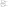

.. tags: flip-flop, latch, VHDL, D latch, SR latch, KTH

Latches
=======

Introduction
------------

Latch is simple, transparent, not clocked, asynchronous, level-sensitive opposed
to flip-flop which is edge-triggered, opaque, clocked, synchronous, edge-sensitive.

SR latch as memory element
--------------------------

For instance SR latch can essentially be used to store one bit of information [#kth]_:

    SR-latch symbol, inverted output may be omitted.

There are various ways to implement SR latch using gates:

    SR latch constructed with two NAND gates

Corresponding concurrent VHDL snippet would be:

.. listing:: src/sr_latch.vhd

Replacing NAND operation with NOR should yield in equivalent circuit with
inputs and outputs inverted however such circuit gets stuck in an unstable
state. Attempting to simulate such circuit using GHDL results in following error message:

.. code::

    ./srlatch_testbench:error: simulation stopped by --stop-delta

This means that GHDL has stopped simulation because states could not settle
within --stop-delta=N delta cycles without progressing time.

.. [#kth] http://www.it.kth.se/courses/IL2217/F4_2.pdf
.. [#sn7400n] http://quarndon.co.uk/index.php?main_page=product_info&products_id=12966
.. [#data_latch] http://www.play-hookey.com/digital/sequential/d_nand_latch.html

