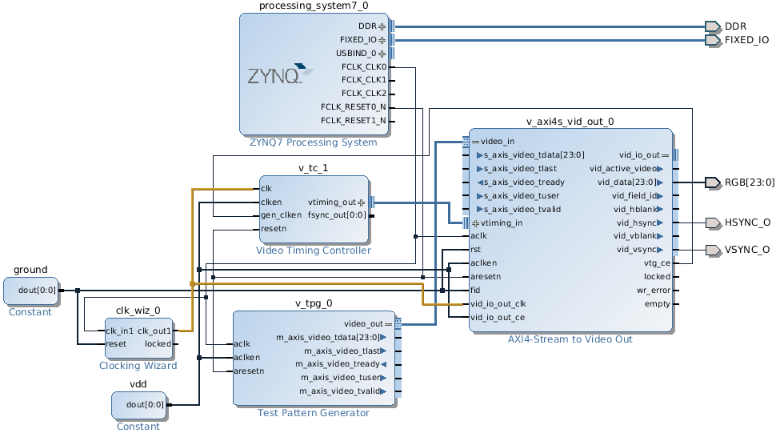
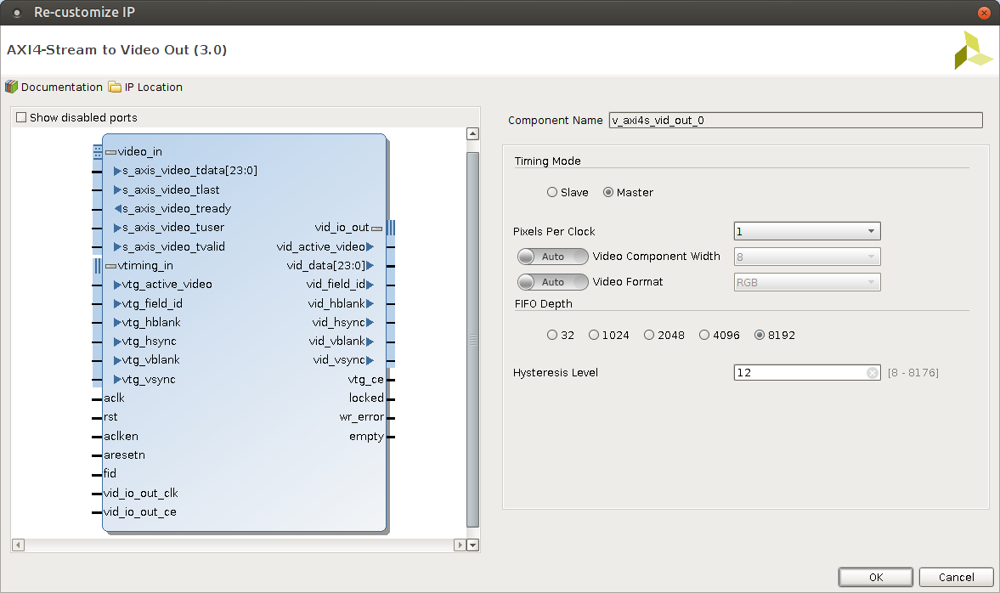
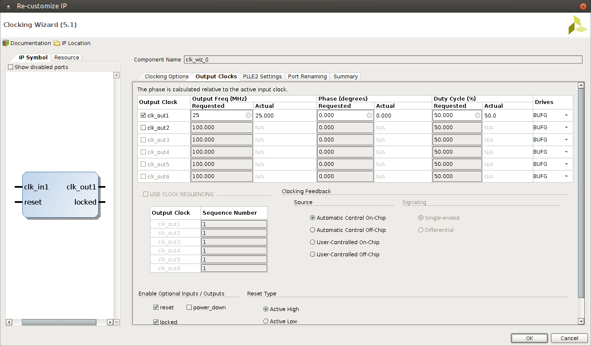

.. tags:  KTH, Xilinx, VGA, FPGA

Connecting test pattern generator to VGA output on ZYBO
=======================================================

Minimal working example
-----------------------

Minimal example of high level block design looks like following.
In this case no intervention from the ARM core side is necessary and
simply uploading the bitstream is enough:

    25MHz pixel clock necessary for running VGA output at 60-70Hz is highlighted with yellow

Test Pattern Generator parameters
---------------------------------

Configure test pattern generator to output RGB pixels, with 8-bit component width
at resolution of 640 by 480 pixels.
Test pattern generator can be configured on-the-fly via AXI4-Lite control register which 
requires extra work, so in this example I have disabled the control register.
Test pattern is vertical and horizontal ramp which is animated.

.. figure:: img/xilinx-test-pattern-generator-parameters.png

    Test pattern generator outputs 24-bit RGB pixels. 

AXI4-Stream to Video Out parameters
-----------------------------------

Video out component esentially does clock domain conversion.
On the *video_in* interface pixels can be pumped in using various
bus widths at *aclk* frequency.
Video out  has internal FIFO which buffers the data and outputs
them at requested bit depth and frewquency of *vid_io_out_clk*.

Frequency of *vid_io_out_clk* can be calculated by refresh rate, horizontal and vertical resolution:

.. math::

    f = RefreshRate * HorizontalResolution * VerticalResolution

For VGA anything between 20MHz and 25MHz should suffice depending on how picky your screen is:
    
.. math::

    f_{VGA} = 75Hz * 640 * 480 = 18 432 000 \frac{pixels}{second} \approx 25MHz
    
    

Clocking wizard parameters
--------------------------
    
The programmable fabric runs on 100MHz by default. Clocking wizard can be used
to derive 25MHz from 100MHz:

    Clocking wizard produces 25MHz signal from 100MHz input

Video timing controller parameters
----------------------------------

In addition to the baseline pixels per second frequency other video timing information 
is necessary to facilitate horizontal and vertical sync.
Video timing controller [#vtc]_ is designed for that purpose:

.. figure:: img/xilinx-video-timing-controller-parameters-2.png

    Video timing controller is configured to output timings for 640x480 resolution however it has nothing to do with the refresh rate of the screen
    
To simplify the example the control registers are disabled here, otherwise
it would be possible to configure the video timings on the fly.
    
.. figure:: img/xilinx-video-timing-controller-parameters-1.png
    
    Control registers are disabled here as well
    

.. [#vtc] http://www.xilinx.com/support/documentation/ip_documentation/v_tc/v6_1/pg016_v_tc.pdf

    
Pin mapping on ZYBO
-------------------
    
Since ZYBO does not have 24-bit output we use following constraints to
map least significant bits to arbitrary Pmod connectors on the board.
Five most significant red/blue and six most significant green bits are mapped
to the 16-bit VGA output on the board:

.. code:: bash

    # Red
    set_property PACKAGE_PIN T20 [get_ports {RGB[0]}]
    set_property PACKAGE_PIN U20 [get_ports {RGB[1]}]
    set_property PACKAGE_PIN V20 [get_ports {RGB[2]}]
    
    set_property PACKAGE_PIN M19 [get_ports {RGB[3]}]
    set_property PACKAGE_PIN L20 [get_ports {RGB[4]}]
    set_property PACKAGE_PIN J20 [get_ports {RGB[5]}]
    set_property PACKAGE_PIN G20 [get_ports {RGB[6]}]
    set_property PACKAGE_PIN F19 [get_ports {RGB[7]}]

    # Green
    set_property PACKAGE_PIN W20 [get_ports {RGB[8]}]
    set_property PACKAGE_PIN Y18 [get_ports {RGB[9]}]
    
    set_property PACKAGE_PIN H18 [get_ports {RGB[10]}]
    set_property PACKAGE_PIN N20 [get_ports {RGB[11]}]
    set_property PACKAGE_PIN L19 [get_ports {RGB[12]}]
    set_property PACKAGE_PIN J19 [get_ports {RGB[13]}]
    set_property PACKAGE_PIN H20 [get_ports {RGB[14]}]
    set_property PACKAGE_PIN F20 [get_ports {RGB[15]}]

    # Blue
    set_property PACKAGE_PIN V15 [get_ports {RGB[16]}]
    set_property PACKAGE_PIN W15 [get_ports {RGB[17]}]
    set_property PACKAGE_PIN T11 [get_ports {RGB[18]}]
    
    set_property PACKAGE_PIN P20 [get_ports {RGB[19]}]
    set_property PACKAGE_PIN M20 [get_ports {RGB[20]}]
    set_property PACKAGE_PIN K19 [get_ports {RGB[21]}]
    set_property PACKAGE_PIN J18 [get_ports {RGB[22]}]
    set_property PACKAGE_PIN G19 [get_ports {RGB[23]}]

    set_property IOSTANDARD LVCMOS33 [get_ports {RGB[*]}]
    set_property SLEW FAST [get_ports {RGB[*]}]

