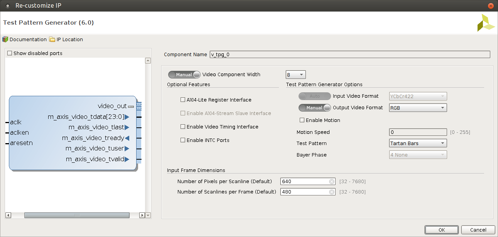
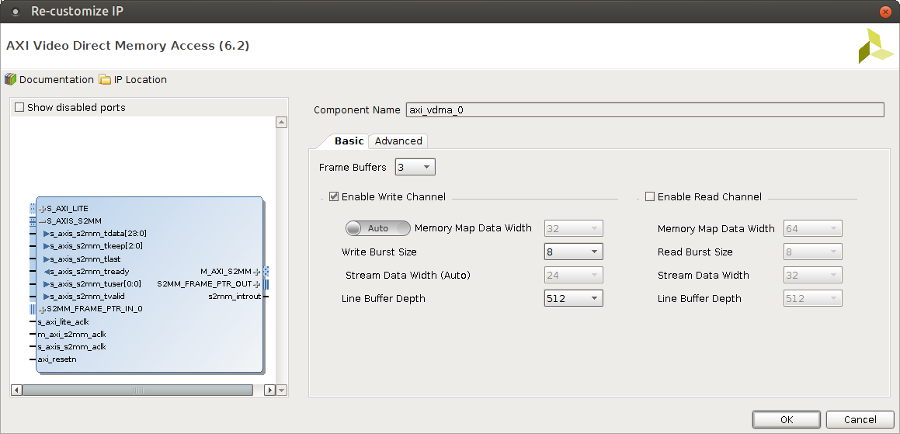

.. tags: VDMA, Video4Linux2, KTH, VHDL, Xilinx

Video capture with VDMA
=======================

Introduction
------------

The S2MM portion of Video DMA component can be used for video capture.
    
.. figure:: dia/axi-vdma-video-capture-pipeline.svg

    Video capture pipeline employing single VDMA instance with only write channel, read channel is disabled
    
Minimal hardware design
-----------------------

As getting everything working at the first attempt is tricky it makes sense 
to substitute actual camera with `test pattern generator <xilinx-test-pattern-generator.html>`_
and kernel module with a userspace snippet which triggers the DMA transfer.

.. figure:: img/axi-tpg-via-vdma.png

    High level block design for transferring frames from Test Pattern Generator to DDR memory using S2MM portion of single VDMA instance.
    
Note that in this case there are two clock domains:
AXI4-Lite slaves are communicating at 100MHz bus speed,
but video signals are transferred at bus frequency of 150MHz.
High speed port clock is highlighted with yellow so if you get
errors regarding clock domains double check the clock signal routing.

.. figure:: img/axi-vdma-s2mm-address-editor.png

    Address mapping with AXI Video Direct Memory Access and AXI Test Pattern Generator
    
In this case VDMA controller control and status registers are mapped
at 0x43000000 using AXI-Lite and that memory address can be
written to in order to initiate a DMA transfer [#axi-vdma]_.
In this example MM2S portion is disabled and
S2MM portion of the VDMA controller has access to the whole physical memory range of 512MB on ZYBO via AXI High Performance port.
This also bears potential security risk as malicious or buggy FPGA bitstream
could make it possible to transmit sensitive DDR memory contents for instance RSA keys to third parties.

Note that without kernel module approach Linux may allocate the DMA memory ranges
to applications and that combination may end up with memory corruption.
In order to avoid that mem=224M should be added to kernel boot arguments
so kernel would not use last 32MB for other processes and threads.
Better solution would be of course to implement kernel module
which *ioremaps* DMA memory ranges aswell as control/status register memory ranges.

    Test pattern generator [#tpg]_ is configured to output AXI4-Stream of 24-bit RGB pixels at resolution of 640x480
    
Such configuratoin should produce tartan bars pattern.
    
.. figure:: img/axi-tpg-tartan-bars.png

    Tartan bars pattern
    

    Only write channel (stream to memory-mapped) is enabled
    

.. figure:: img/axi-vdma-parameters-2.png    

    s2mm tuser signal emitted by test pattern generator [#tpg]_ is used for frame synchronization
    
.. [#axi-vdma] `LogiCORE IP AXI Video Direct Memory Access v6.2 <http://www.xilinx.com/support/documentation/ip_documentation/axi_vdma/v6_2/pg020_axi_vdma.pdf>`_
.. [#tpg] `Test Pattern Generator v6.0 <http://www.xilinx.com/support/documentation/ip_documentation/v_tpg/v6_0/pg103-v-tpg.pdf>`_

Minimal software design
-----------------------

TODO

Interfacing with OV7670 camera module
-------------------------------------

TODO

.. [#ov7670] http://www.voti.nl/docs/OV7670.pdf

Video4Linux2 driver
-------------------

TODO
