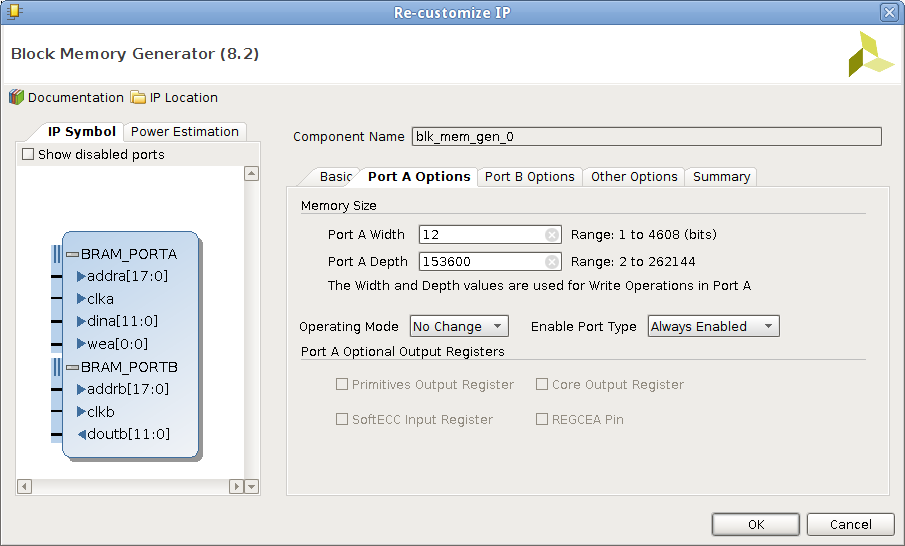
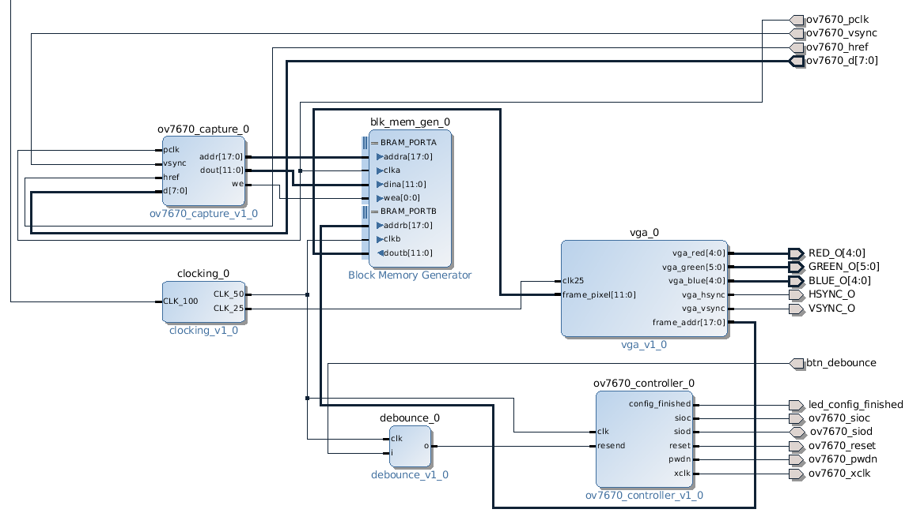

.. tags: VHDL, Vivado, ZYBO
.. flags: hidden
.. published: 2014-11-10

Piping OV7670 video to VGA output on ZYBO
=========================================

Hamsterworks has great examples for Zynq boards [#hamsterworks]_.
In this example VGA frames are grabbed from OV7670 chipset based camera and
stored in Block RAM based framebuffer.
VGA controller block generates clock for the analog VGA video output
and reads back the scanlines from framebuffer.

ZYBO is however more resource constrained so several modifications were required.
In this case we're reducing the vertical resolution twofold since ZYBO
does not have enough Block RAM to contain whole VGA frame.
The example is basically working on ZYBO, but there are still few bugs that need to be ironed out.

The capture block:

.. listing:: src/ov7670_capture.vhd

VGA output block:

.. listing:: src/ov7670_vga.vhd

**Port width** refers to amount of bits that can be read/written at once or in other words the size of a memory slot.
**Port depth** refers to count of such slots which translates to address bit width.

    Block RAM generator parameters
    
    

    High level design

.. [#hamsterworks] http://hamsterworks.co.nz/mediawiki/index.php/OV7670_camera
