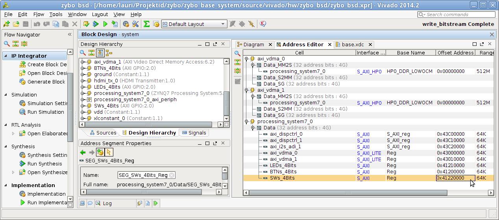

.. title: ZYBO quickstart
.. date: 2014-07-02
.. tags: ZYBO, Xilinx, Vivado, VHDL

Introduction
------------

I previously tried to outline detailed process of creating hardware design for
ZYBO using Vivado [#vivado-2014.1-vs-zybo]_, but as it turned out to consume
significant amount of time spent on learning vendor specific stuff I decided to take the shortcut.
Digilent provides ZYBO Base System Design [#zybo_base_system]_ which includes
prepared high level block design and IP cores for VGA output, HDMI output,
and audio codec input/output.
As it is easier to remove useless blocks than to create block design from scratch
this is recommended course of action.

Preparing bitstream
-------------------

Bitstream is a 2MB binary file which configures the programmable logic of ZYBO.
Unfortunately the bitstream file can currently be compiled only with
proprietary tools from Xilinx.
When you're purchasing ZYBO from Digilent you have option to get 
20 USD accessories kit for ZYBO which includes Vivado voucher.
With the Voucher you get Vivado and it's updates for a year since the date of purchase.

ZYBO Base System Design includes all you need to compile the bitstream file.
In order to use the design you need to download Vivado [#vivado-download]_,
redeem your voucher to get the license and during Vivado install 
point it to the *Xilinx.lic* file. Note that license will be bound to the
MAC address of the particular machine.

Preparing microSD card
----------------------

The easiest is to use Xillinux as a starting point [#xillinux]_.
Grab the Xillinux image and dump it to your microSD card.
Note that previous contents of the card will be lost:

.. code:: bash

    umount /dev/mmcblk0p*
    wget -c http://xillybus.com/downloads/xillinux-1.3.img.gz
    zcat xillinux-1.3.img.gz > /dev/mmcblk0
    partprobe

Now you have your memory card populated with 
FAT32 filesystem for u-boot and ext4 filesystem which hosts Ubuntu root filesystem.
Next step is to place device tree definition file and first stage bootloader to the
first (FAT32) filesystem:

.. code:: bash

    wget -c http://xillybus.com/downloads/xillinux-eval-zybo-1.3v.zip
    unzip xillinux-eval-zybo-1.3v.zip
    mkdir /mnt/xillyboot
    mount /dev/mmcblk0p1 /mnt/xillyboot
    cp xillinux-eval-zybo-1.3v/bootfiles/boot.bin /mnt/xillyboot
    cp xillinux-eval-zybo-1.3v/bootfiles/devicetree.dtb /mnt/xillyboot
    umount /mnt/xillyboot
    sync

    
Booting on Zynq-7000 SoC-s
--------------------------

In order to boot the first (FAT32) filesystem has to contain:

* *boot.bin*, the first stage bootloader.
* *xillydemo.bit*, the bitstream file.
* *devicetree.dtb* is the device tree which should be generated by Vivado but I currently can't seem to
  find a way to do it there. Instead I rely on the one provided by Xillinux.
  
About device tree
-----------------

Device tree concept was introduced in Linux 3.15 with the purpose of easing
Linux adoption on embedded devices.
In a traditional PC sophisticated mechanisms such as PCI and PCI Express
are used to detect what kind of hardware has been connected and
what drivers should be loaded for them.
That is not the case for ARM as it does not have such peripherial arbitration
capabilities.
For usual ARM devices a device tree is provided from the vendor and it's
available in the mainline Linux source tree.
The programmable logic of Zynq-7000 SoC makes the hardware configurable
to a high degree via the bitstream file and this is where the device tree is used to describe:

* What kind of peripherial devices are connected via PL
* Which memory addresses have been allocated to peripherial devices
  for memory mapped input/output
* Which interrupts kernel knows about

Note that device tree is **not necessary** to enable memory mapped input/output.
The Xillinux device tree seems to pass through the shared interrupt numbered 91.
There are basically 16 peripherial devices that can be connected to that shared
interrupt. Note that kernel module has to be written for handling hardware
interrupts as it is not possible to hook up an interrupt handler from a userspace
program. The kernel module may however translate interrupts to whatever a
userspace program can understand eg. signals or blocking FIFO.
Shared interrupt means that you need to use bitmasks to determine which event 
actually happened and afterwards still read the particular PL output from the
memory mapped region.

Blinking LED-s!
---------------

Linux provides access to the physical memory addresses via /dev/mem.
It's a character device whose lower 512MB represent the physical DDR RAM
present on the board.
Peripherial devices are accessible via memory ranges predefined in the bitstream using memory mapped input/output.
The ZYBO base system Vivado project contains following setup:

	Address editor

To blink the LED-s on the board you can just grab the LEDs_4bits Offset Address
from the Address Editor and using mmap() you can write and read that memory
range as if it was regular array:

.. code:: python

    from time import sleep
    import mmap

    with open("/dev/mem", "r+b") as f:
        mm = mmap.mmap(f.fileno(), 4, offset=0x41210000)
        while True:
            try:
                mm[0] = chr(0xff)
                sleep(0.2)
                mm[0] = chr(0x00)
                sleep(0.2)
            except KeyboardInterrupt:
                break
        mm.close()

.. [#vivado-2014.1-vs-zybo] `ZYBO vs Vivado 2014.1 <http://lauri.vosandi.com/posts/vivado-2014.1-vs-zybo.html>`_
.. [#zybo_base_system] `ZYBO Base System <http://www.digilentinc.com/Data/Products/ZYBO/zybo_base_system.zip>`_
.. [#vivado-download] http://www.xilinx.com/support/download.html
.. [#xillinux] `Xillinux: A Linux distribution for Zedboard, ZyBo, MicroZed and SocKit <http://xillybus.com/xillinux>`_

