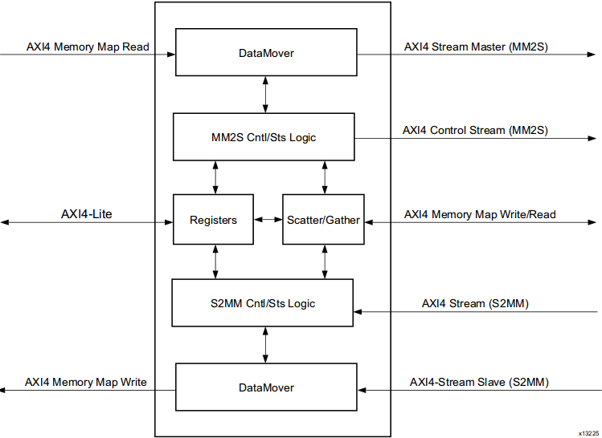
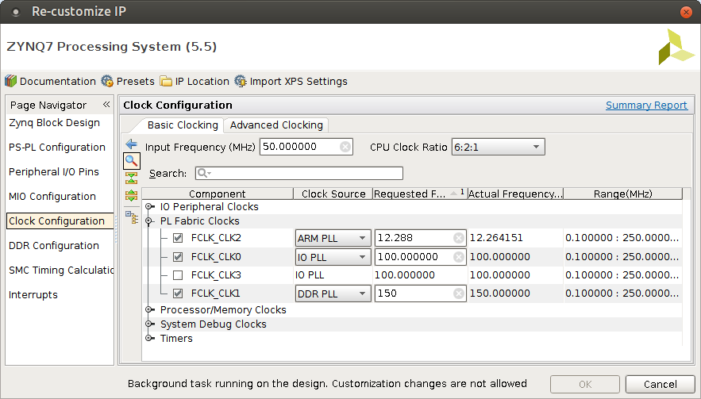

.. published: 2014-12-12
.. flags: hidden

AXI Direct Memory Access
========================

Introduction
------------

Getting started with direct memory access on Xilinx boards may
be initially overwhelming.
First of all Xilinx distinguishes AXI DMA and AXI VDMA in programmable fabric.
AXI DMA refers to traditional FPGA direct memory access which 
roughly corresponds to transferring arbitrary streams of bytes
from FPGA to a slice of DDR memory and vice versa.
VDMA refers to video DMA which adds mechanisms to handle 
frame synchronization using ring buffer in DDR,
on-the-fly video resolution changes, cropping and zooming.
Video DMA is covered in `next article <xilinx-vdma.html>`_.
In addition to AXI DMA and AXI VDMA there is a DMA engine built into the ARM core
which is also out of the scope of this article.
Both AXI DMA and AXI VDMA have optional scatter-gather support which means that
instead of writing memory addresses or framebuffer addresses to
control registers the DMA controller grabs them from linked list in DDR memory.
Scatter-gather features are out of scope of this article.

Internals
---------

AXI DMA distinguishes two channels:
MM2S (memory-mapped to stream) transports data from DDR memory to FPGA and
S2MM (stream to memory-mapped) transports arbitrary data stream to DDR memory.

    AXI DMA internals

Minimal working hardware
------------------------

The simplest way to instantiate AXI DMA on Zynq-7000 based boards is to
take board vendor's base design, strip unnecessary components,
add AXI Direct Memory Access IP-core and connect the output stream port
to it's input stream port. This essentially implements *memcpy*
functionality which can be triggered from ARM core but offloaded to programmable fabric.

    AXI Direct Memory Access stream output is looped back to stream input
    
To be more precise, following is the corresponding high level block design.
High speed clock line is highlighted in yellow as it runs on higher frequency of 150MHz
while the general purpose port runs at 100MHz. Clock domain errors can usually 
be tracked back to conflicting clock lines. This is further explained in the end of this article.

.. figure:: high-level-design/axi-dma-loopback.png

    High level block design corresponding to abstract design presented earlier
    
In the AXI Direct Memory Access IP-core customization dialog
read channel and write channel correspond respectively to MM2S and S2MM portions of the DMA block.
Memory map data width of 32 bits means that 4 bytes will be transferred during
one bus cycle. This means the *tdata* port of the stream interface will be 32 bits wide.

.. figure:: img/axi-dma-parameters.png

    Both read/write channels are enabled and scatter-gather engine is disabled

AXI Direct Memory Access component's control register, status register
and transfer address registers are accessible via the
AXI Lite slave port which is memory mapped to address range
of 0x40400000 - 0x4040FFFF.
The whole memory range of 0x00000000-0x1FFFFFFF is accessible via both
stream to memory-mapped and memory-mapped to stream channel.
AXI DMA [#axi-dma]_ documentation has the offsets of the registers accessible via AXI Lite port.
In this case MM2S control register of 32-bits is accessible at 0x40400000,
MM2S status register of 32-bits at 0x40400004 and so forth.
    
.. figure:: img/axi-dma-address-editor.png

.. important:: Note that customizing the AXI Direct Memory Access IP-core parameters causes memory ranges to be reset under Address Editor!

Minimal working software
------------------------

When it comes to writing C code I see alarming tendency of defaulting to vendor
provided components: stand-alone binary compilers, Linux distributions, board
support packages, wrappers while avoiding learning what actually happens in
the hardware/software.

As described in my `earlier article <zybo-quickstart.html>`_ physical memory
can be accessed in Linux via /dev/mem block device.
This makes it possible to access AXI Lite registers simply by reading/writing
to a memory mapped range from /dev/mem.
To use DMA component minimally four steps have to be taken:

1. Start the DMA channel (MM2S, S2MM or both) by writing 1 to control register
2. Write start/destination addresses to corresponding registers
3. To initiate the transfer(s) write transfer length(s) to corresponding register(s).
4. Monitor status register for IOC_Irq flag.

In this case we're copying 32 bytes from physical address of 0x0E000000 to
physical addres of 0x0F000000. Note that kernel may allocate memory for
other processes in that range and that is the primary reason to write a kernel
module which would *request_mem_region* so no other processes would overlap with the memory range.
Besides reserving memory ranges the kernel module provides a sanitized way
of accessing the hardware from userspace applications via /dev/blah block devices.

.. listing:: src/axi_dma_memcpy.c

Successful run should look something like this:

.. code::

    Source memory block:      44332211 7dcddfdf 5a7fefa4 36aa3c9b ca2eea6a 5bf64f81 ebf7ffbb b7f710d2 
    Destination memory block: 00000000 00000000 00000000 00000000 00000000 00000000 00000000 00000000 
    Resetting DMA
    Stream to memory-mapped status (0x00000001@0x34): halted
    Memory-mapped to stream status (0x00000001@0x04): halted
    Halting DMA
    Stream to memory-mapped status (0x00000001@0x34): halted
    Memory-mapped to stream status (0x00000001@0x04): halted
    Writing destination address
    Stream to memory-mapped status (0x00000001@0x34): halted
    Writing source address...
    Memory-mapped to stream status (0x00000001@0x04): halted
    Starting S2MM channel with all interrupts masked...
    Stream to memory-mapped status (0x00000000@0x34): running
    Starting MM2S channel with all interrupts masked...
    Memory-mapped to stream status (0x00000000@0x04): running
    Writing S2MM transfer length...
    Stream to memory-mapped status (0x00000000@0x34): running
    Writing MM2S transfer length...
    Memory-mapped to stream status (0x00000000@0x04): running
    Waiting for MM2S synchronization...
    Waiting for S2MM sychronization...
    Stream to memory-mapped status (0x00001002@0x34): running idle IOC_Irq
    Memory-mapped to stream status (0x00001002@0x04): running idle IOC_Irq
    Destination memory block: 44332211 7dcddfdf 5a7fefa4 36aa3c9b ca2eea6a 5bf64f81 ebf7ffbb b7f710d2 

Note that IOC_Irq signifies that transfer completion interrupt was triggered.

Clocks
------

    Processing system may generate up to 4 clocks

High-speed slave ports (S_AXI_HP0 .. S_AXI_HP1) and 
associated ports (M00_AXI, S00_AXI, S01_AXI, M_AXI_MM2S, M_AXI_S2MM)
run at 150MHz dictated by FCLK_CLK1.
Master in this case means that the bus transfers are initiated by the master
which in this case is the AXI Direct Memory Access component.
AXI Interconnect in this case is acting merely as a switch in an ethernet network
multiplexing multiple AXI ports (S00_AXI, S01_AXI) to single M00_AXI.

General-purpose port (M_AXI_GP0) including all AXI Lite slaves (run at 100MHz.
In this case Zynq7 Processing System is the transfer initiator.
AXI Protocol Converter similarily to AXI Interconnect allows access
to multiple AXI Lite slaves (S_AXI_LITE in this case) via single AXI Lite master
port (M_AXI_GP0) on the Zynq7 Processing System.

.. [#axi-dma] `LogiCORE IP AXI DMA v7.1, Product Guide PG021 <http://www.xilinx.com/support/documentation/ip_documentation/axi_dma/v7_1/pg021_axi_dma.pdf>`_
