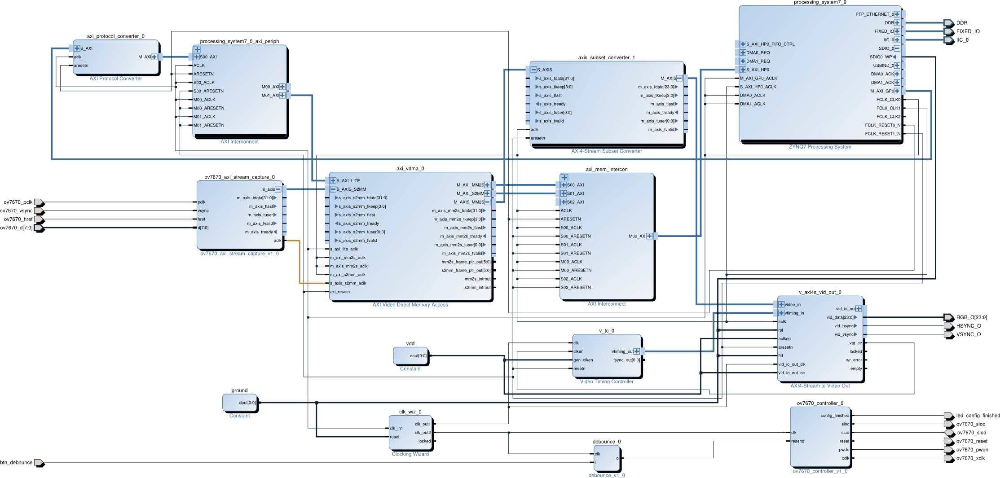

.. flags: hidden
.. published: 2014-12-01

Complete video processing pipeline on ZYBO
==========================================

Introduction
------------

Xilinx libraries contain Video Direct Memory Access (VDMA) IP-core which can be
used to transfer AXI4-Stream protocol based video stream to DDR memory and vice versa.
Corresponding sub-components are S2MM (Stream to memory-mapped) also known as write channel and
MM2S (Memory-mapped to stream) also known as read channel.
Using both of them a video buffer can be implemented with optional
crop and zoom features [#zoom-pipeline]_.

.. [#zoom-pipeline] http://www.xilinx.com/support/documentation/ip_documentation/axi_videoip/v1_0/ug934_axi_videoIP.pd

Minimal hardware design
-----------------------

This is the last and the most complex example of what I have tried on the ZYBO.

    High level block design for complete hardware pipeline

In this example we connect Omnivision OV7670 camera
via modified capture block to AXI4-Stream Video compatible
pipeline.
The VDMA controller maintains a ring buffer in the DDR memory
and transfers the frame data to these buffers as the frames are received by S2MM
portion of the VDMA controller.

.. figure:: img/axi-vdma-both-address-editor.png

    Address mapping with AXI Video Direct Memory Access
    
.. [#axi-vdma] `LogiCORE IP AXI Video Direct Memory Access v6.2 <http://www.xilinx.com/support/documentation/ip_documentation/axi_vdma/v6_2/pg020_axi_vdma.pdf>`_

