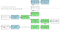
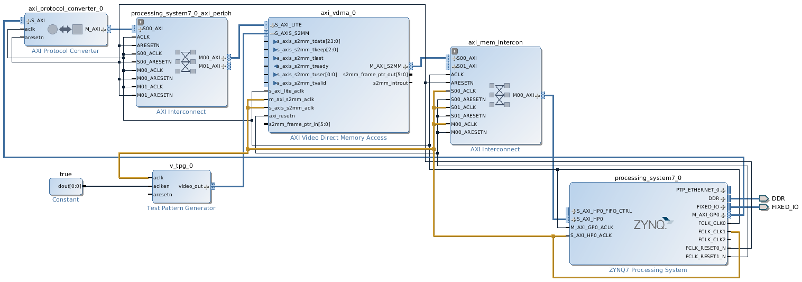
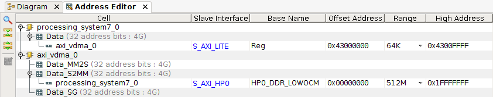
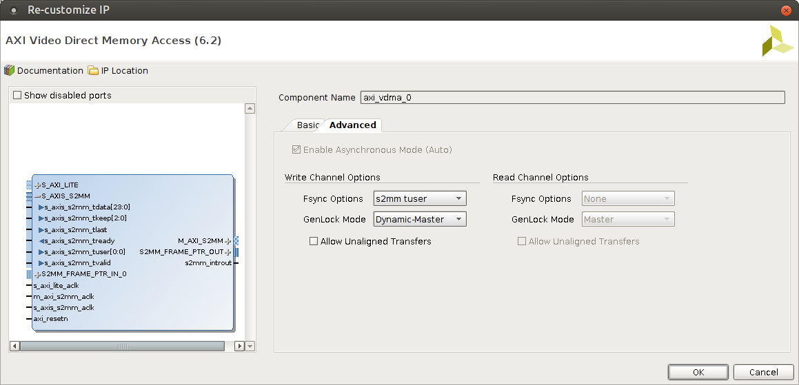

.. tags: VDMA, Video4Linux2, KTH, VHDL, Xilinx

Video capture with VDMA
=======================

Introduction
------------

The S2MM portion of Video DMA component can be used for video capture.
    

    Ideal pipeline for video capture employing single VDMA instance with only write channel, read channel is disabled.
    
Minimal hardware design
-----------------------

As getting everything working at the first attempt is tricky it makes sense 
to substitute actual camera with `test pattern generator <xilinx-test-pattern-generator.html>`_
and kernel module with a userspace snippet which triggers the DMA transfer.

    High level block design for transferring frames from Test Pattern Generator to DDR memory using S2MM portion of single VDMA instance.
    
Note that in this case there are two clock domains:
AXI4-Lite slaves are communicating at 100MHz bus speed,
but video signals are transferred at bus frequency of 150MHz.
High speed port clock is highlighted with yellow so if you get
errors regarding clock domains double check the clock signal routing.

    Address mapping with AXI Video Direct Memory Access and AXI Test Pattern Generator
    
In this case VDMA controller control and status registers are mapped
at 0x43000000 using AXI-Lite and that memory address can be
written to in order to initiate a DMA transfer.
In this example MM2S portion is disabled and
S2MM portion of the VDMA controller has access to the whole physical memory range of 512MB on ZYBO via AXI High Performance port.
This also bears potential security risk as malicious or buggy FPGA bitstream
could make it possible to transmit sensitive DDR memory contents for instance RSA keys to third parties.

Note that without kernel module approach Linux may allocate the DMA memory ranges
to applications and that combination may end up with memory corruption.
In order to avoid that mem=224M should be added to kernel boot arguments
so kernel would not use last 32MB for other processes and threads.
Better solution would be of course to implement kernel module
which *ioremaps* DMA memory ranges aswell as control/status register memory ranges.

.. figure:: img/axi-tpg-parameters.png

    Test pattern generator [#tpg]_ is configured to output AXI4-Stream of 24-bit RGB pixels at resolution of 640x480
    
Such configuration should produce tartan bars pattern.
    

    Tartan bars pattern
    
.. figure:: img/axi-vdma-parameters-1.png

    Only write channel (stream to memory-mapped) is enabled
    

    s2mm tuser signal emitted by test pattern generator [#tpg]_ is used for frame synchronization

.. [#tpg] `Test Pattern Generator v6.0 <http://www.xilinx.com/support/documentation/ip_documentation/v_tpg/v6_0/pg103-v-tpg.pdf>`_

Minimal software design
-----------------------

Following example for managing triple-buffered VDMA component
should be pretty explainatory.
Code is roughtly based on Ales Ruda's work [#vdma-on-zedboard]_
with heavy modifications based on Xilinx reference manual:

.. listing:: src/axi_vdma_demo.c

Note that this is just a demo code which is not exactly
usable for any practical application mainly because the memory ranges
assigned for framebuffers are not reserved by any kernel module.
For real applications AXI (V)DMA driver should be used.
It builds proper abstraction such as /dev/axi_dma_0 or /dev/axi_vdma_0 which
can be accessed from userspace applications [#axi-dma-driver]_.

.. [#vdma-on-zedboard] http://arbot.cz/post/2013/03/20/VDMA-on-ZedBoard.aspx
.. [#axi-dma-driver] https://github.com/Xilinx/linux-xlnx/tree/master/drivers/dma/xilinx

Grabbing frames over HTTP
-------------------------

Once the VDMA transfer is running you can use following Python snippet on
the ZYBO to grab a frame from DDR memory and serve it over HTTP:

.. listing:: src/pngserver.py

Simply open http://zybo-ip-address:80 on your laptop assuming 
that the laptop and ZYBO are attached to same network.

Interfacing with OV7670 camera module
-------------------------------------

The Hamsterworks controller block can be reused
to initialize the camera, there are no modifications required there.
The Hamsterworks capture component however is not suitable for interfacing with
AXI4-Stream Video compatible cores. Thus we need a slightly modified
block which generates corresponding frame and line synchronization primitives.

.. listing:: src/ov7670_axi_stream_capture/ov7670_axi_stream_capture.vhd

Modified block converts 16-bit RGB (5:6:5) signal to 32-bit RGBA (8:8:8:8) signal
with fake opaque alpha channel.
This way whole pixel is transferred during
one AXI bus cycle and start-of-frame and end-of-line signals are perfectly
aliged with the content.

Substituting test pattern generator with the modified capture block and 
adding controller block should be enough to have the video input from the camera
connected to AXI4-Stream Video compatible pipeline.

.. [#ov7670] http://www.voti.nl/docs/OV7670.pdf

Video4Linux2 driver
-------------------

As Zynq-7000 boards have I²C bus master built-in, it make sense to take advantage
of that feature instead of implementing controller block from scratch.
On ZYBO the EEPROM and audio codec are connected to the I²C bus,
but it should be possible to route I²C bus to Pmod connectors using
IIC_0 port on Zynq7 processing system block.
It should also be possible to access the I²C bus via /dev/i2c-0 device node
if corresponding kernel modules have been loaded [#i2cdetect]_.
This should make it possible to take advantage of OV7670 kernel module [#ov7670-kernel-module]_
which was written for One Laptop Per Child project.
This way the camera initialization can be done by kernel and the camera
can be configured via any Video4Linux application instead of
static bitstream.
How transferring the frames could be done in this case is not however clear yet.

.. [#i2cdetect] `Scanning a I²C bus for available slave devices <http://e2e.ti.com/support/microcontrollers/tiva_arm/f/908/t/235977.aspx>`_
.. [#ov7670-kernel-module] http://www.cs.fsu.edu/~baker/devices/lxr/http/source/linux/drivers/media/video/ov7670.c

