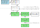

.. tags: Xilinx, AXI4-Stream Video, VDMA, VHDL

AXI4-Stream to Video Out
========================

The ports on board are connected as follows in case of ZYBO:

.. figure:: https://reference.digilentinc.com/_media/zybo:vga1.png

	ZYBO's analog video output "DAC" is simply a resistor latter.

VDMA component can be used to implement video output on Zynq-7000 boards.

    Video output pipeline employing single VDMA instance with only read channel, write channel is disabled
    
    
Minimal working example
-----------------------

TODO

Kernel framebuffer driver
-------------------------

TODO
