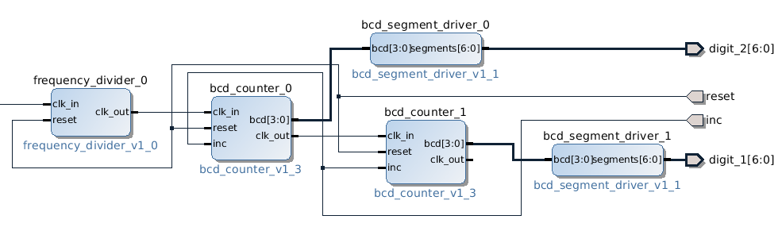

.. date: 2014-10-05
.. tags: VHDL, ZYBO, KTH, BCD

Decimal counter on ZYBO
=======================

Introduction
------------

In this article I'll attempt to outline steps needed to convert VHDL design into a usable
application on ZYBO board.
I am going to assume that person attempting to follow the guide has familiarized herself with
ZYBO basics and is using ZYBO Base System Design as starting point for the high level block design.

Sample files
------------

In this case we're connecting two segment displays to Pmod connectors and use programmable fabric to convert
bus frequency to seconds shown on the segment display:

.. listing:: src/frequency_divider.vhd

BCD counter counts up to 10 and then overflows [#divider]_:

.. listing:: src/bcd_counter.vhd

Segment driver decodes BCD signal to segment display lanes:

.. listing:: src/bcd_segment_driver.vhd

These files should be added by:

* Open **Tools** → **Create and Package IP**
* Select **Package your current project** 
* Point **IP location** to the folder containing these three files
* Click **Next**
* Click **Finish**
* IP editor window should be opened now
* Make adjustments to the VHDL code if necessary
* Under **Package IP** tab open **Review and Pacakage** step, click **Package IP** button

Block design
------------

In the Vivado high level block design window click **Add IP**, search for the IP core that was added and double click on it.
Apply the same for remaining blocks.
Use block design editor to combine frequency divider, BCD counter and BCD segment drivers:

    Frequency divider is connected to the ZYBO bus clocked at 50MHz

Pin mapping
-----------

Each ZYBO Pmod connector is basically connected to 8-bit port of programmable fabric.
Each port's 1st pin is marked with square and pins 1-4 are in the top row and pins 5-8 are in the row closer to the PCB.
Remaining four pins are connected to 3.3V and ground rails and they're explicitly marked on the board.

Pin mapping is described in ZYBO reference manual PDF documentation [#marsee]_.
Edit **Constraints** → **constrs_1** → **base.xdc** to reflect your setup:

.. code::

    # Connect BTN0 to reset line
    set_property PACKAGE_PIN R18 [get_ports {reset}]
    set_property IOSTANDARD LVCMOS33 [get_ports {reset}]

    # Pmod connector JB
    set_property PACKAGE_PIN T20 [get_ports {digit_2[0]}]
    set_property PACKAGE_PIN U20 [get_ports {digit_2[1]}]
    set_property PACKAGE_PIN V20 [get_ports {digit_2[2]}]
    set_property PACKAGE_PIN W20 [get_ports {digit_2[3]}]
    set_property PACKAGE_PIN Y18 [get_ports {digit_2[4]}]
    set_property PACKAGE_PIN Y19 [get_ports {digit_2[5]}]
    set_property PACKAGE_PIN W18 [get_ports {digit_2[6]}]
    set_property IOSTANDARD LVCMOS33 [get_ports {digit_2[*]}]

    # Pmod connector JC
    set_property PACKAGE_PIN V15 [get_ports {digit_1[0]}]
    set_property PACKAGE_PIN W15 [get_ports {digit_1[1]}]
    set_property PACKAGE_PIN T11 [get_ports {digit_1[2]}]
    set_property PACKAGE_PIN T10 [get_ports {digit_1[3]}]
    set_property PACKAGE_PIN W14 [get_ports {digit_1[4]}]
    set_property PACKAGE_PIN Y14 [get_ports {digit_1[5]}]
    set_property PACKAGE_PIN T12 [get_ports {digit_1[6]}]
    set_property IOSTANDARD LVCMOS33 [get_ports {digit_1[*]}]

    # Connect SW0 to increment/decrement toggle
    set_property PACKAGE_PIN G15 [get_ports {inc}]
    set_property IOSTANDARD LVCMOS33 [get_ports {inc}]

Final steps
-----------

Press **Generate Bitstream** in the left-hand panel under **Program and Debug**,
the file will be written to
**zybo_base_system/source/vivado/hw/zybo_bsd/zybo_bsd.runs/impl_1/system_wrapper.bit**.
Transfer the file to the first FAT32 partition of the microSD card and reset the device.

.. figure:: img/zybo-counter.jpg

    ZYBO in action

.. [#marsee] http://marsee101.blog19.fc2.com/blog-entry-2902.html
.. [#divider] http://www.codeproject.com/Articles/443644/Frequency-Divider-with-VHDL
