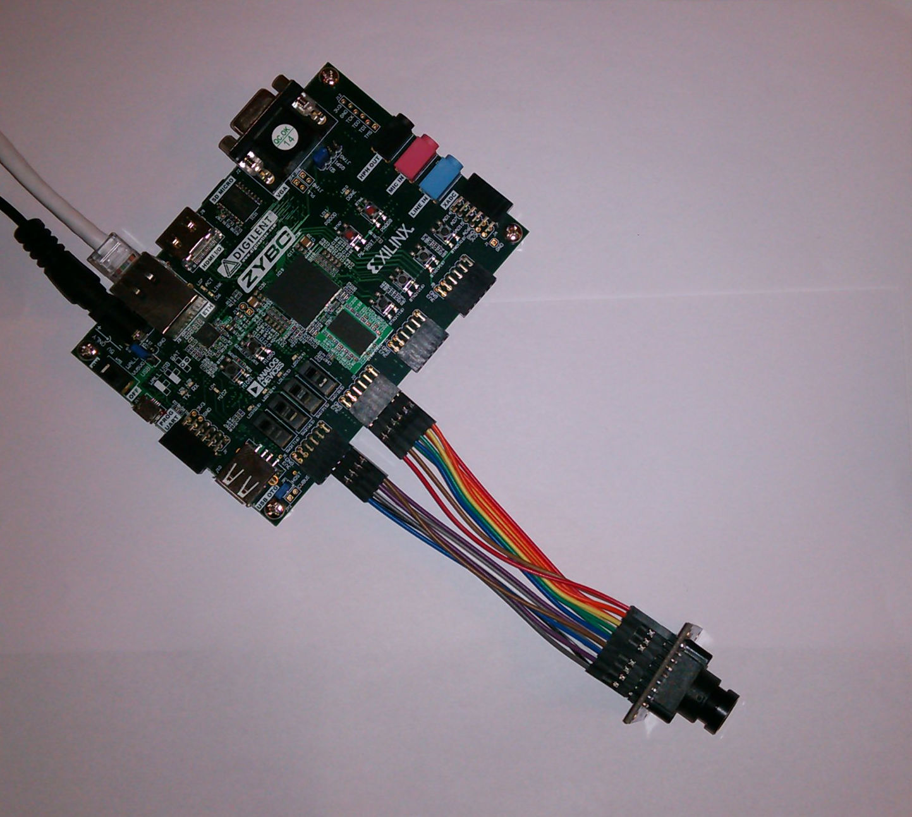
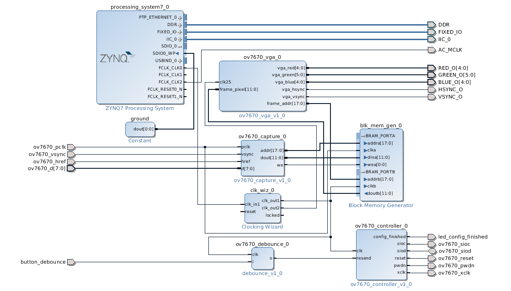

.. tags: VHDL, Vivado, ZYBO
.. flags: hidden
.. published: 2014-11-10

Piping OV7670 video to VGA output on ZYBO
=========================================

Introduction
------------

Before getting into more complex topics such as AXI Stream and direct memory access,
it's recommended to first get familiar with pixel data encoding schemes and
video timing signals.
Hamsterworks has great examples for Zynq boards [#hamsterworks]_.
In this example VGA frames are grabbed from OV7670 chipset based camera and
stored in Block RAM based framebuffer.

.. figure:: http://www.elecfreaks.com/store/images/OV7670%20Camera%20Module_A.JPG

    Omnivision OV7670 is a cheap 640x480 30fps camera module.

ZYBO is however more resource constrained so several modifications were required.
In this case we're reducing the vertical resolution twofold since ZYBO
does not have enough Block RAM to contain whole VGA frame.
The example is basically working on ZYBO, but there are still few bugs that need to be ironed out.

.. [#hamsterworks] http://hamsterworks.co.nz/mediawiki/index.php/OV7670_camera

Capture block
-------------

The capture block parses VSYNC and HREF signals and converts them
into block RAM address.
Pixel data is also a bit tricky - OV7670 transmits half of an 16-bit RGB (5:6:5)
pixel during one PCLK cycle. Capture block latches the previous half and
combines two halves into 12-bit RGB (4:4:4) pixel which is stored in block RAM.
You are encouraged to use logic analyzer to debug video timing signals,
as connecting wires to VGA output while display is connected is troublesome
you might have to route extra pins onto Pmod connectors for debugging purposes.

.. listing:: src/ov7670_capture/ov7670_capture.vhd

Video output block
------------------

VGA output block generates HSYNC and VSYNC signals for the video outputs
and corresponding input for the read address. 

.. listing:: src/ov7670_vga/ov7670_vga.vhd

It essentially plays the role of video card in a PC.

Controller block
----------------

Omnivision OV7670 uses Omnivision Serial Camera Control Bus (SCCB) protocol
to set up the camera parameters.
SCCB actually is I²C-compliant interface, but avoids the usage of I²C brand
due to licensing fees [#sccb]_.
The controller component is composed of three components:
I²C bus master, OV7670 instructions and glue code.

The first one is used to emulate I²C bus master:

.. listing:: src/ov7670_controller/i2c_sender.vhd

The second one contains OV7670 setup instructions:

.. listing:: src/ov7670_controller/ov7670_registers.vhd

Third one contains glue code for the IP core that can actually be instantiated:

.. listing:: src/ov7670_controller/ov7670_controller.vhd

.. [#sccb] http://e2e.ti.com/support/dsp/davinci_digital_media_processors/f/99/t/6092

Importing VHDL code
-------------------

To insert VHDL code snippets into Vivado:

* From the main menu select **Tools** →  **Create and Package IP**, click **Next**.
* Select **Package a specified directory**, click **Next**.
* Locate the directory which contains VHDL files for **IP location**, click **Next**.
* Set **Project name** to main component name.
* Set **Project location** to the parent folder of the VHDL files.
* Click **Finish**

Once you have added everything to the library it's time to instantiate
the code in the design, for each component add the corresponding block:

* Click on **Open Block Design** under **IP Integrator** to open up the high level block design.
* Right click in the designer area and select **Add IP...**
* Locate the components added earlier
* Repeat same steps for all components

Next step is to insert block RAM, clocking wizard and connect the components.

Instantiating block RAM
-----------------------

Since block RAM is highly platform specific
a Xilinx block has to be inserted.
Right click in the high level design → **Add IP...** → **Block Memory Generator**
to insert block RAM. Right click on the block → **Customize block...**
opens up the dialog for editing block RAM parameters.

**Stand Alone** mode makes it possible to generate **Simple Dual Port RAM**
which is essentially memory with write port and read port.
**Port width** refers to amount of bits that can be read/written at once or in other words the size of a memory slot.
**Port depth** refers to count of such slots which translates to address bit width.

.. figure:: img/block-ram-generator.png

    Block RAM generator parameters
    
Routing pins
------------   

The **base.xdc** important chunks are following:

.. code:: bash

    # Debounce button and config finished LED
    set_property PACKAGE_PIN R18 [get_ports button_debounce]
    set_property PACKAGE_PIN M14 [get_ports led_config_finished]

    # Top JE
    set_property PACKAGE_PIN H15 [get_ports ov7670_reset]
    set_property PACKAGE_PIN J16 [get_ports {ov7670_d[1]}]
    set_property PACKAGE_PIN W16 [get_ports {ov7670_d[3]}]
    set_property PACKAGE_PIN V12 [get_ports {ov7670_d[5]}]

    # Bottom JE
    set_property PACKAGE_PIN Y17 [get_ports ov7670_pwdn]
    set_property PACKAGE_PIN T17 [get_ports {ov7670_d[0]}]
    set_property PACKAGE_PIN U17 [get_ports {ov7670_d[2]}]
    set_property PACKAGE_PIN V13 [get_ports {ov7670_d[4]}]

    # Top JD
    set_property PACKAGE_PIN R14 [get_ports {ov7670_d[7]}]
    set_property PACKAGE_PIN P14 [get_ports ov7670_pclk]
    set_property PACKAGE_PIN T15 [get_ports ov7670_vsync]
    set_property PACKAGE_PIN T14 [get_ports ov7670_sioc]

    # Bottom JD
    set_property PACKAGE_PIN V18 [get_ports {ov7670_d[6]}]
    set_property PACKAGE_PIN V17 [get_ports ov7670_xclk]
    set_property PACKAGE_PIN U15 [get_ports ov7670_href]
    set_property PACKAGE_PIN U14 [get_ports ov7670_siod]
    
    # Voltage levels
    set_property IOSTANDARD LVCMOS33 [get_ports button_debounce]
    set_property IOSTANDARD LVCMOS33 [get_ports led_config_finished]
    set_property IOSTANDARD LVCMOS33 [get_ports ov7670_pclk]
    set_property IOSTANDARD LVCMOS33 [get_ports ov7670_sioc]
    set_property IOSTANDARD LVCMOS33 [get_ports ov7670_vsync]
    set_property IOSTANDARD LVCMOS33 [get_ports ov7670_reset]
    set_property IOSTANDARD LVCMOS33 [get_ports ov7670_pwdn]
    set_property IOSTANDARD LVCMOS33 [get_ports ov7670_href]
    set_property IOSTANDARD LVCMOS33 [get_ports ov7670_xclk]
    set_property IOSTANDARD LVCMOS33 [get_ports ov7670_siod]
    set_property IOSTANDARD LVCMOS33 [get_ports {ov7670_d[*]}]
    
    # Magic
    set_property CLOCK_DEDICATED_ROUTE FALSE [get_nets ov7670_pclk_IBUF]
    
Using the pin mapping above the camera can be connected cleanly
to the board:

    Omnivision OV7670 attached to Pmod connectors JD and JE.
    
Remember to connect GND and 3.3V rails of the ZYBO to cameras GND and 3.3V rails.

Final high level design
-----------------------    
    

    High level design

Click on **Generate bitstream** button and transfer resulting bitstream file to the boot partition and restart ZYBO.

Summary
-------

If you've connected camera correctly you should see the video feed from the camera
on the screen attached to VGA output.
Capture and controller blocks can be re-used in other examples involving 
Omnivision OV7670 camera, so it's important to get expected outcome at this point.
