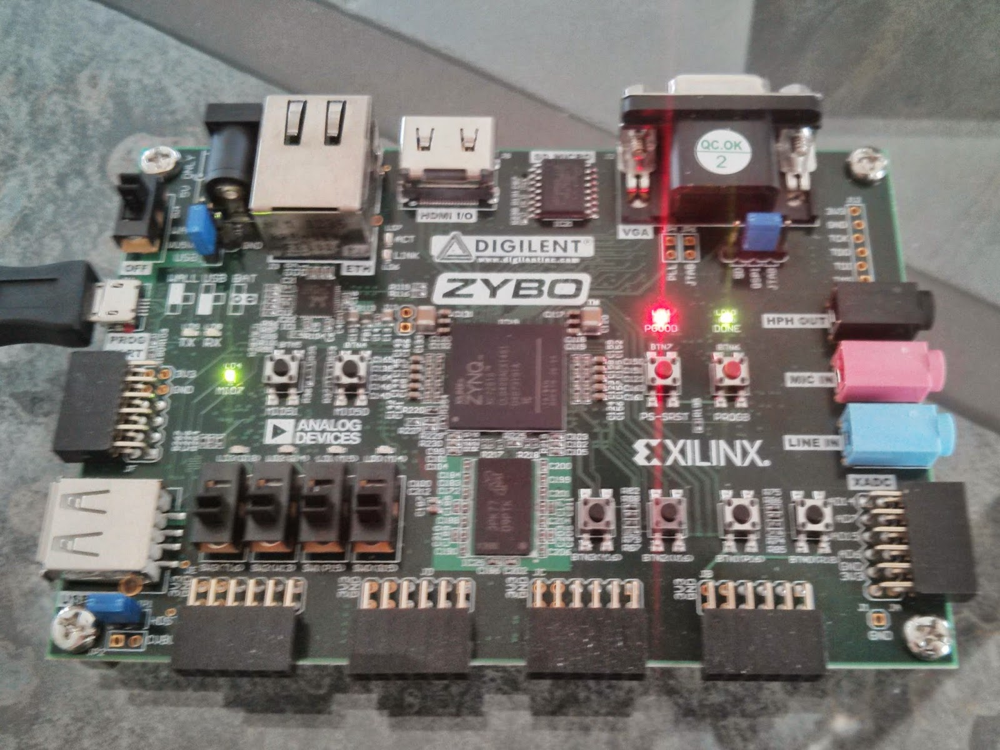

.. title: ZYBO quickstart
.. date: 2014-07-02
.. tags: ZYBO, Xilinx, Vivado, VHDL

Getting started with Zynq-7000 boards
=====================================

Introduction
------------

Studying FPGA development is rather expensive process and so far the cheapest
way to get started in my opinion is to get equipped with
Digilent ZYBO development board, OV7670 camera, Salea logic analyzer,
a breadboard, light emitting diodes, segment displays and some 220 ohm resistors.
If you get lucky you can push it down to 200€ budget.

ZYBO is a Zynq-7000 SoC based board from Digilent.
This is a little HOWTO for getting started with ZYBO, but this should
serve well anyone who wants to get on the track with Zynq-7000 based boards
such as Zedboard, Microzed, ZC702 evaluation board etc.

    ZYBO is a Zynq-7000 SoC based entry level board.
    

Previously I attempted to outline detailed process of creating hardware design
for ZYBO using Vivado, but as it turned out to consume significant amount of
time spent on learning vendor specific stuff I decided to take the shortcut.
Digilent provides ZYBO Base System Design [#zybo-base-system]_ which includes
prepared high level block design and IP cores for VGA output, HDMI output,
and audio codec input/output.

As it is easier to remove useless blocks than to create block design from scratch
this is recommended course of action.
Base designs should be available for all Zynq-7000 boards from the
corresponding hardware vendors.
Otherwise you have to follow pretty complex guide to 
set up the high level block design from scratch [#creating-base-zynq-design-vivado]_.

.. [#zybo-base-system] `ZYBO Base System <http://www.digilentinc.com/Data/Products/ZYBO/zybo-base-system.zip>`_
.. [#creating-base-zynq-design-vivado] http://zedboard.org/content/creating-base-zynq-design-vivado-ipi-20132

Installing Vivado
-----------------

Bitstream is a 2MB binary file which configures the programmable logic of ZYBO.
Unfortunately the bitstream file can currently be compiled only with
proprietary tools from Xilinx.
When you're purchasing ZYBO from Digilent you have option to get 
20 USD accessories kit for ZYBO which includes Vivado voucher.
With the Voucher you get license for Vivado and it's updates for a year since the date of purchase.
You can download Vivado at Xilinx web  [#vivado-download]_,
just follow release notes to install Vivado and the license file *Xilinx.lic*.
Note that license will be bound to the
MAC address of the particular machine.

.. [#vivado-download] http://www.xilinx.com/support/download.html

Working around Vivado quirks
----------------------------

If you encounter floating point formatting exception try disabling locales by
appeding following to Vivado's **settings64.sh**:

.. code:: bash

    export LANG=C
    
If you bump into NullPointerException while attempting to run Tools → Create Package and IP
try to:

* Open from main menu **Tools** →  **Project settings**
* Click on **IP**
* Select **Packager** tab
* Make sure **Vendor** field value if anything but **(none)**

Preparing bitstream
-------------------

ZYBO Base System Design [#zybo-base-system]_ includes all you need to compile
the bitstream file for ZYBO.
Uncompress the .zip file and open the
project file **source** → **vivado** → **hw** → **zybo_bsd** → **zybo_bsd.xpr**
with Vivado.

With newer Vivado versions you get notifications that IP blocks can be upgraded.
Follow instructions on the screen to update the components.
Once you have finished with the hardware design
click on the lefthand panel **Program and Debug** → **Generate Bitstream**
this will generate the 2MB blob that represents your FPGA configuration.

Preparing microSD card
----------------------

The easiest is to use Xillinux as a starting point [#xillinux]_.
Grab the Xillinux image and dump it to your microSD card.
Note that previous contents of the card will be lost:

.. code:: bash

    umount /dev/mmcblk0p*
    wget -c http://xillybus.com/downloads/xillinux-1.3.img.gz
    zcat xillinux-1.3.img.gz > /dev/mmcblk0
    partprobe

Now you have your memory card populated with 
FAT32 filesystem for u-boot and ext4 filesystem which hosts Ubuntu 12.04 root filesystem.
Next step is to place device tree definition file and first stage bootloader to the
first (FAT32) filesystem:

.. code:: bash

    wget -c http://xillybus.com/downloads/xillinux-eval-zybo-1.3v.zip
    unzip xillinux-eval-zybo-1.3v.zip
    mkdir /mnt/xillyboot
    mount /dev/mmcblk0p1 /mnt/xillyboot
    cp xillinux-eval-zybo-1.3v/bootfiles/boot.bin /mnt/xillyboot
    cp xillinux-eval-zybo-1.3v/bootfiles/devicetree.dtb /mnt/xillyboot
    cp path/to/zybo_base_system/source/vivado/hw/zybo_bsd/zybo_bsd.runs/impl_1/system_wrapper.bit /mnt/xillyboot/xillydemo.bit
    umount /mnt/xillyboot
    sync
    
.. [#xillinux] `Xillinux: A Linux distribution for Zedboard, ZyBo, MicroZed and SocKit <http://xillybus.com/xillinux>`_

Booting Zynq-7000 board
-----------------------

In order to boot ZYBO the first (FAT32) filesystem has to contain:

* *boot.bin*, the first stage bootloader shipper by Xillinux.
* *xillydemo.bit*, the bitstream file produced by Vivado.
* *devicetree.dtb* is the device tree which should be generated by Vivado but I currently can't seem to
  find a way to do it there. Instead I rely on the one provided by Xillinux.
* *uImage*, the Linux kernel shipped by Xillinux.
  
Xillinux provided image has u-boot embedded to the the beginning of the
card image which use the files mentioned above to set up hardware using
the bitstream file, load kernel to RAM, load device tree to RAM and continue
booting the kernel.
Once kernel is up and running the kernel looks for root filesystem on the
second partition which contains ext4 filesystem.
If root filesystem is mounted successfully, the /sbin/init binary is invoked
to continue the boot process.

If you have connected ZYBO via micro USB cable you can access the console
via the built-in FTDI USB-UART bridge. Once you connect the cable to your
Ubuntu laptop /dev/ttyUSB0 and /dev/ttyUSB1 should appear.
Use picocom to connect to the virtual serial port:

.. code:: bash

    sudo apt-get install picocom
    sudo picocom -b 115200 /dev/ttyUSB0
    
    
Connecting via OpenSSH
----------------------
    
As ZYBO has ethernet port onboard it makes sense to connect to the command-line
via OpenSSH instead. Hook up an ethernet cable to ZYBO and connect it to a router
or anything that provides DHCP service for automatically configuring the
IP address of ZYBO. Otherwise you have to resort to manually configuring
IP-s on your laptop, ZYBO and setting up masquerading and packet forwarding [#ubuntu-connection-sharing]_

Once the network is up and running you may install OpenSSH on ZYBO:

.. code:: bash

    sudo apt-get install openssh-server
    
Generate SSH keys using ssh-keygen on your laptop if you haven't done so yet and copy-paste
the public key to ZYBO's /root/.ssh/authorized_keys2, this way you can avoid typing
password every time you log in via OpenSSH [#ubuntu-openssh-keys]_.

As inserting and ejecting microSD card becomes eventually tedious
I recommend using OpenSSH to transfer bitstream to the device.
Make sure the first FAT32 partition is mounted at /boot on the Zynq-7000 board.
OpenSSH should be installed on Ubuntu laptop by default, so you can simply issue:

.. code:: bash

    scp \
      path/to/zybo_base_system/source/vivado/hw/zybo_bsd/zybo_bsd.runs/impl_1/system_wrapper.bit \
      root@xillinux:/boot/xillydemo.bit
    
This method of course does not work if the board does not boot at all and
in that case you have to resort to inserting the microSD card to your laptop.

.. [#ubuntu-connection-sharing] https://help.ubuntu.com/community/Internet/ConnectionSharing
.. [#ubuntu-openssh-keys] https://help.ubuntu.com/community/SSH/OpenSSH/Keys

  
About device tree
-----------------

Device tree concept was introduced in Linux 3.15 with the purpose of easing
Linux adoption on embedded devices.
In a traditional PC sophisticated mechanisms such as PCI and PCI Express
are used to detect what kind of hardware has been connected and
what drivers should be loaded for them.
That is not the case for ARM as it does not have such peripherial arbitration
capabilities.
For usual ARM devices a device tree is provided from the vendor and it's
available in the mainline Linux source tree.
The programmable logic of Zynq-7000 SoC makes the hardware configurable
to a high degree via the bitstream file and this is where the device tree is used to describe:

* What kind of peripherial devices are connected via PL
* Which memory addresses have been allocated to peripherial devices
  for memory mapped input/output
* Which interrupts kernel knows about

Note that device tree is **not necessary** to enable memory mapped input/output.
The Xillinux device tree seems to pass through the shared interrupt numbered 91.
There are basically 16 peripherial devices that can be connected to that shared
interrupt. Note that kernel module has to be written for handling hardware
interrupts as it is not possible to hook up an interrupt handler from a userspace
program. The kernel module may however translate interrupts to whatever a
userspace program can understand eg. signals or blocking FIFO.
Shared interrupt means that you need to use bitmasks to determine which event 
actually happened and afterwards still read the particular PL output from the
memory mapped region.

Blinking LED-s!
---------------

Linux provides access to the physical memory addresses via /dev/mem.
It's a character device whose lower 512MB represent the physical DDR RAM
present on the board.
Peripherial devices are accessible via memory ranges predefined in the bitstream using memory mapped input/output.
The ZYBO base system Vivado project contains following setup:

.. figure:: img/zybo-address-editor.png

    Address editor

To blink the LED-s on the board you can just grab the LEDs_4bits Offset Address
from the Address Editor and using mmap() you can write and read that memory
range as if it was regular array using following Python snippet.

.. code:: python

    from time import sleep
    import mmap

    with open("/dev/mem", "r+b") as f:
        mm = mmap.mmap(f.fileno(), 4, offset=0x41210000)
        while True:
            try:
                mm[0] = chr(0xff)
                sleep(0.2)
                mm[0] = chr(0x00)
                sleep(0.2)
            except KeyboardInterrupt:
                break
        mm.close()
        
Just dump the contents to a file and invoke with python at command-line.

In the source tree you'll find **base.xdc** which contains pin mapping
for button block, switch block, LED block onboard and other preconfigured
ports:

.. code:: bash

    # Button block
    set_property PACKAGE_PIN R18 [get_ports {btns_4bits_tri_i[0]}]
    set_property PACKAGE_PIN P16 [get_ports {btns_4bits_tri_i[1]}]
    set_property PACKAGE_PIN V16 [get_ports {btns_4bits_tri_i[2]}]
    set_property PACKAGE_PIN Y16 [get_ports {btns_4bits_tri_i[3]}]
    set_property IOSTANDARD LVCMOS33 [get_ports {btns_4bits_tri_i[*]}]

    # LED block
    set_property PACKAGE_PIN M14 [get_ports {leds_4bits_tri_o[0]}]
    set_property PACKAGE_PIN M15 [get_ports {leds_4bits_tri_o[1]}]
    set_property PACKAGE_PIN G14 [get_ports {leds_4bits_tri_o[2]}]
    set_property PACKAGE_PIN D18 [get_ports {leds_4bits_tri_o[3]}]
    set_property IOSTANDARD LVCMOS33 [get_ports {leds_4bits_tri_o[*]}]

    # Switch block
    set_property PACKAGE_PIN G15 [get_ports {sws_4bits_tri_i[0]}]
    set_property PACKAGE_PIN P15 [get_ports {sws_4bits_tri_i[1]}]
    set_property PACKAGE_PIN W13 [get_ports {sws_4bits_tri_i[2]}]
    set_property PACKAGE_PIN T16 [get_ports {sws_4bits_tri_i[3]}]
    set_property IOSTANDARD LVCMOS33 [get_ports {sws_4bits_tri_i[*]}]

Pmod connectors on the board are not by default connected to any ports.
In addition to attaching port in the high level block design constraints
have to be added for the corresponding pins.
On the wide side ZYBO has standard Pmod connector JE connected via built-in 200Ω resistors and
three hi-speed Pmod connectors JD, JC, JB with no resistors [#zybo-refman]_:

    Two leftmost Pmod connectors JE, JD on the wider edge of ZYBO

    Two rightmost Pmod connectors JC, JB on the wider edge of ZYBO

Pin mappings for other ports can be found in ZYBO reference manual [#zybo-refman]_
and they're virtually impossible to locate simply by searching the Internet.

.. [#zybo-refman] `ZYBO Reference Manual <http://www.digilentinc.com/Data/Products/ZYBO/ZYBO_RM_B_V5.pdf>`_

